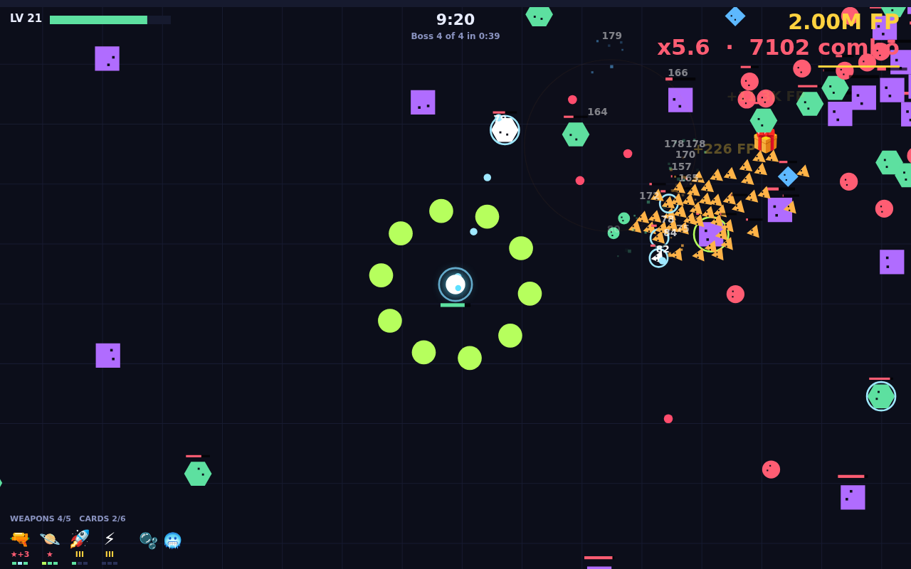
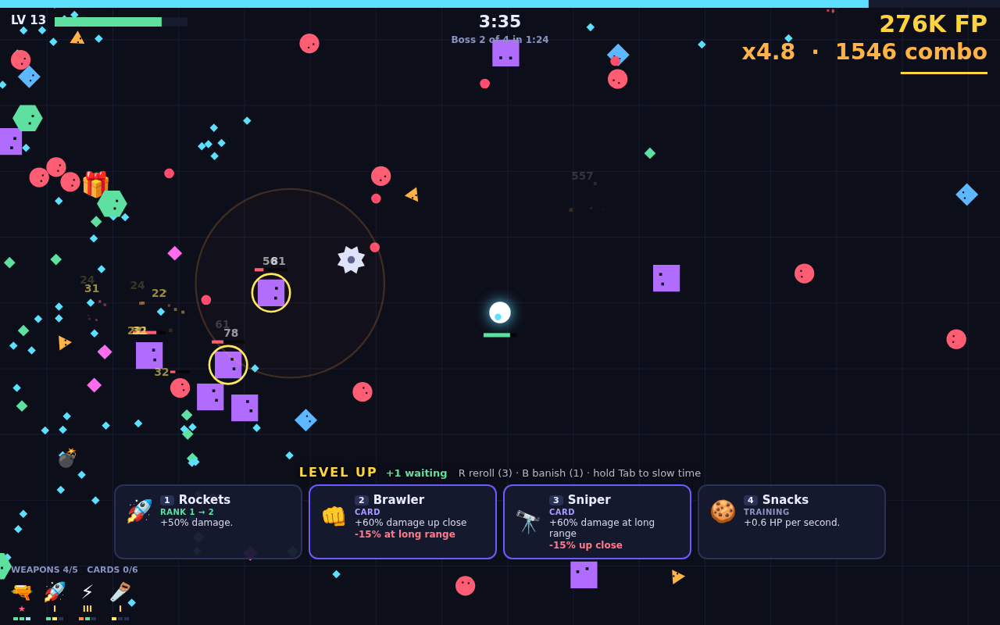
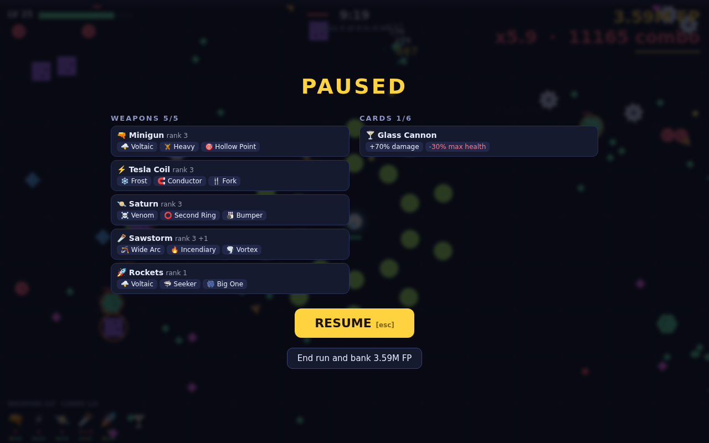
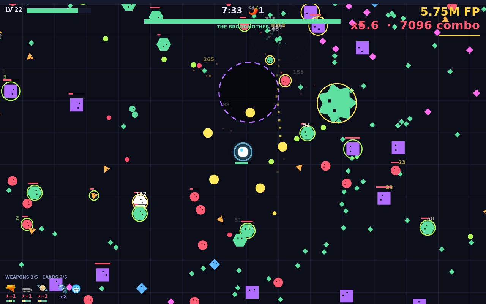
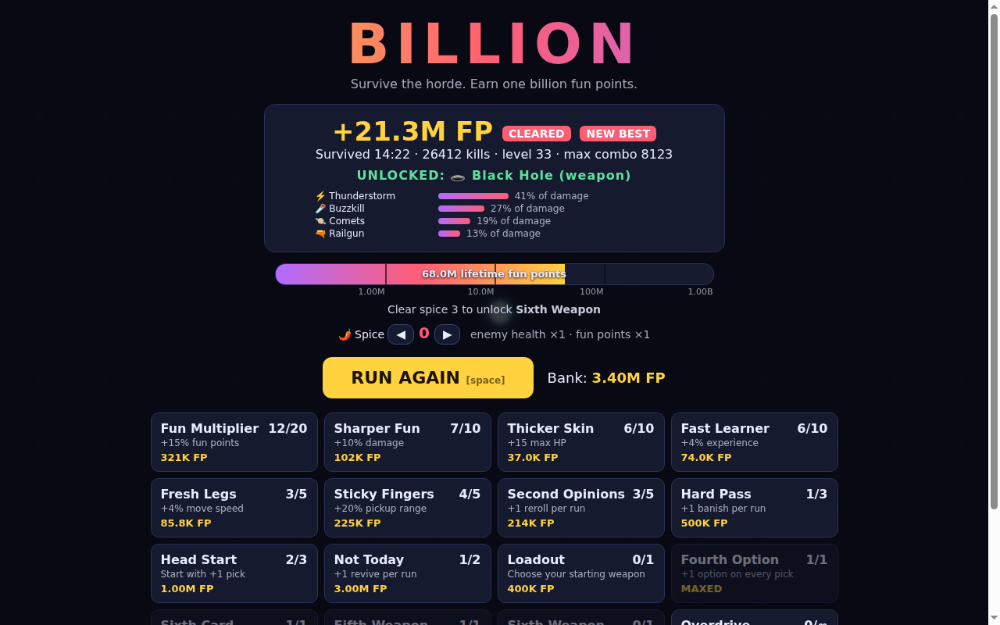

# BILLION

A horde-survival roguelite that runs in a browser tab. Survive the horde, build something ridiculous, and earn one billion lifetime fun points.

**[Play it here](https://loganbradley787.github.io/billion/)**. No install, no account. Progress is saved in your browser.



## How it plays

You move; your weapons fire on their own. Enemies drop experience, each level gives you a pick, and the picks are the game. A run lasts about 13 minutes if you make it: four bosses, then a final boss, then an overtime that gets worse every second until it kills you.

Whatever you earned goes to the bank. The shop turns it into permanent upgrades, and the next run starts stronger.

| Key | Does |
|---|---|
| WASD / arrows | Move (touch: drag anywhere) |
| 1–5 | Take a pick |
| R / B | Reroll the offer / banish an option for the rest of the run |
| Tab | Hold to slow time while picks are waiting |
| Esc or P | Pause and see your build |
| M | Mute |

## Builds

Level-ups don't stop the action. The offer sits in a tray at the bottom of the screen and you take it when you have a moment.



A pick is one of:

- **A new weapon.** Eleven of them, from the starting Pea Shooter to things you unlock by earning more.
- **A rank.** Three per weapon. More damage, and usually something extra.
- **A mod.** Each weapon holds three. Some are universal (fire, frost, venom, shock, heavier, faster, bigger); most belong to one weapon and change how it behaves, like a sawblade that flies a boomerang loop or mines that stick to whatever touches them.
- **An evolution.** A weapon at rank 3 with three mods evolves, and you choose one of two forms. The Pea Shooter becomes a Minigun or a Railgun; Rockets become Cluster Bombs or a Nuke.
- **A card.** Changes how you play instead of what one weapon does: more damage up close, more fire rate while moving, a shield bubble. Most cards trade something away, and some rule each other out.
- **Training.** Small permanent stat bumps, for when nothing else fits.

Statuses combine. Fire eats a share of an enemy's health and spreads through a crowd. Frost slows, then freezes, and frozen enemies shatter. Venom stacks on anything tough. Shock arcs your next hit to its neighbours. Fire on a poisoned enemy combusts; shock on a frozen one shatters it on the spot.

Pausing shows the whole build:



## Bosses

One arrives every two and a half minutes, each with its own attack: a ring of bullets, a charge, a brood of minions, a spinning spray. The final boss uses all four in turn.



## Between runs



- **The shop** sells permanent upgrades: damage, health, rerolls, revives, extra weapon and card slots.
- **Unlocks** come from lifetime points and from clearing runs. New weapons, mods and cards join the pool as you go.
- **Spice** is the difficulty ladder. Clearing a run unlocks the next level: tougher enemies, three times the points.
- **One billion** is the goal. Something happens when you get there.

## Running it yourself

It is plain HTML, canvas and JavaScript with no dependencies and no build step.

```sh
git clone https://github.com/LoganBradley787/billion.git
cd billion
open index.html        # or just double-click it
```

Opened that way, the save lives in the browser's local storage. To keep the save in a file instead (handy across browsers on one machine):

```sh
node server.js         # http://127.0.0.1:8377, saves to save.json
```

## Project layout

| Path | What it is |
|---|---|
| `index.html` | Page, styles and script tags |
| `js/data.js` | Every weapon, mod, card, shop item and enemy, as data, plus the tuning constants |
| `js/core.js` | Canvas setup, helpers, saving, sound, input |
| `js/game.js` | The simulation: spawning, damage, statuses, weapons, picks |
| `js/ui.js` | Hub, pick tray, pause screen, rendering, main loop |
| `server.js` | Optional local server with a file-backed save |
| `tools/sim.js` | Bot plays whole runs headlessly, for balance checks |
| `tools/solo.js` | Benchmarks one weapon at a time against the standard horde |
| `classic/` | The original single-file version of the game |
| `PLAN.md` | Design notes for the upgrade system |

Balance checks:

```sh
node tools/sim.js runs=5 save=fresh build=smart     # a new player's first five runs
node tools/sim.js runs=3 save=max heat=2            # a maxed save on spice 2
node tools/solo.js w=saw,rocket mins=8 runs=2       # two weapons, like for like
```
